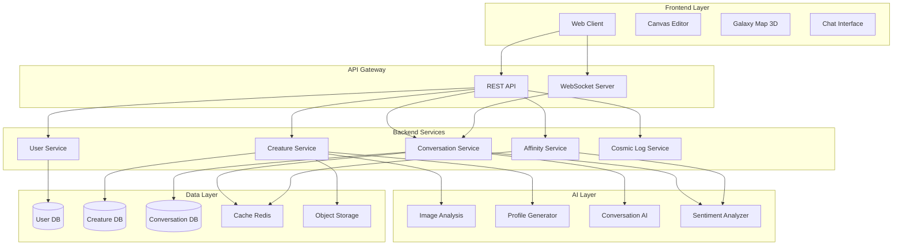
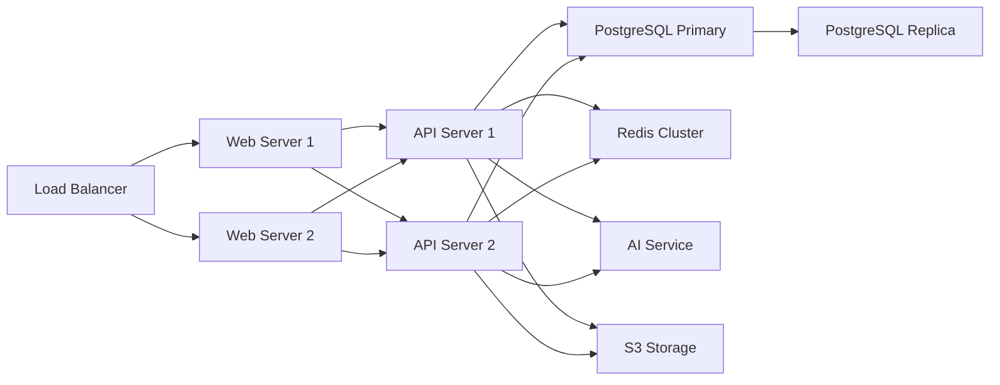

# Design Document

## Overview

星际漂流计划（Cosmic Drift）采用现代Web应用架构，结合AI服务和实时通信技术，构建一个可扩展的数字生命互动平台。系统分为前端展示层、后端服务层、AI处理层和数据存储层，通过RESTful API和WebSocket实现通信。

核心设计理念：
- **情感优先**：所有交互设计围绕情感连接展开
- **性能与体验平衡**：在保证流畅体验的前提下实现复杂的AI功能
- **可扩展性**：支持大规模用户和生命体的增长
- **诗意美学**：视觉和交互设计体现柔和、神秘的氛围

## Architecture

### System Architecture



### Technology Stack

**Frontend:**
- React 18 + TypeScript
- Three.js (Galaxy Map 3D渲染)
- Fabric.js (Canvas绘图)
- TailwindCSS (样式系统)
- Framer Motion (动画)
- Socket.io-client (实时通信)

**Backend:**
- Node.js + Express
- TypeScript
- Socket.io (WebSocket)
- Bull (任务队列)

**AI Services:**
- OpenAI GPT-4 (对话生成、档案生成)
- CLIP (图像分析)
- Sentiment Analysis Library (语气分析)

**Data Storage:**
- PostgreSQL (关系数据)
- Redis (缓存、会话)
- AWS S3 / MinIO (图片存储)

**Infrastructure:**
- Docker + Kubernetes
- Nginx (反向代理)
- PM2 (进程管理)

## Components and Interfaces

### 1. Creature Creation Module

**Components:**
- `CreatureCanvas`: 绘图画布组件
- `ImageUploader`: 图片上传组件
- `ProfileEditor`: 档案编辑器
- `AIProfileGenerator`: AI档案生成服务

**Interface:**

```typescript
interface CreatureCreationRequest {
  imageData: string; // Base64 or URL
  userCustomization?: {
    name?: string;
    story?: string;
  };
}

interface CreatureProfile {
  id: string;
  name: string;
  species: string;
  personality: string[];
  habitat: string;
  imageUrl: string;
  creatorId: string;
  createdAt: Date;
  status: 'drifting' | 'adopted';
  emotionValue: number; // 0-100
}

interface AIAnalysisResult {
  visualFeatures: {
    dominantColors: string[];
    style: string;
    complexity: number;
  };
  suggestedProfile: {
    species: string;
    personality: string[];
    habitat: string;
  };
}
```

**Flow:**
1. User draws/uploads image → Frontend sends to backend
2. Backend calls AI Image Analysis service
3. AI generates profile suggestions
4. User reviews and customizes
5. Profile saved to database, image to object storage

### 2. Galaxy Map Visualization

**Components:**
- `GalaxyScene`: Three.js场景管理器
- `CreatureNode`: 3D生命节点
- `CameraController`: 相机控制
- `ProfileCardOverlay`: 档案卡片浮层

**Interface:**

```typescript
interface GalaxyMapData {
  creatures: CreatureNode[];
  totalCount: number;
}

interface CreatureNode {
  id: string;
  position: Vector3;
  profile: CreatureProfile;
  visualState: {
    color: string;
    size: number;
    glowIntensity: number;
  };
}

interface InteractionEvent {
  type: 'click' | 'hover' | 'zoom';
  creatureId?: string;
  position?: Vector3;
}
```

**Design Decisions:**
- 使用instanced rendering优化大量节点渲染
- 实现LOD（Level of Detail）系统，远距离简化渲染
- 节点位置基于创建时间和情绪值动态计算
- 采用八叉树空间分割优化碰撞检测

### 3. Conversation System

**Components:**
- `ChatInterface`: 聊天UI组件
- `MessageHandler`: 消息处理器
- `ConversationEngine`: 对话引擎
- `MemoryManager`: 记忆管理器

**Interface:**

```typescript
interface Message {
  id: string;
  conversationId: string;
  senderId: string;
  senderType: 'user' | 'creature';
  content: string;
  timestamp: Date;
  sentiment?: SentimentAnalysis;
}

interface Conversation {
  id: string;
  userId: string;
  creatureId: string;
  messages: Message[];
  memoryType: 'temporary' | 'longterm';
  affinityScore: number;
  startedAt: Date;
  lastMessageAt: Date;
}

interface ConversationContext {
  creature: CreatureProfile;
  recentMessages: Message[];
  userSentimentHistory: SentimentAnalysis[];
  conversationSummary?: string;
}

interface AIResponse {
  content: string;
  emotionShift: number; // -10 to +10
  memoryPoints: string[]; // Key points to remember
}
```

**Flow:**
1. User sends message via WebSocket
2. Backend retrieves conversation context
3. Sentiment analyzer processes user message
4. Conversation AI generates response with creature personality
5. Response sent back via WebSocket
6. Affinity score updated asynchronously

### 4. Affinity Calculation Engine

**Components:**
- `AffinityCalculator`: 契合度计算器
- `InteractionTracker`: 互动追踪器
- `AdoptionTrigger`: 认养触发器

**Interface:**

```typescript
interface AffinityMetrics {
  interactionFrequency: number; // Messages per day
  toneCompatibility: number; // 0-100
  timeSpan: number; // Days since first interaction
  conversationDepth: number; // Average message length
  emotionalResonance: number; // Sentiment alignment
}

interface AffinityScore {
  userId: string;
  creatureId: string;
  score: number; // 0-100
  metrics: AffinityMetrics;
  lastCalculated: Date;
}

interface AdoptionInvitation {
  id: string;
  creatureId: string;
  userId: string;
  message: string; // AI-generated invitation
  createdAt: Date;
  status: 'pending' | 'accepted' | 'declined';
}
```

**Calculation Algorithm:**

```
affinityScore = (
  interactionFrequency * 0.25 +
  toneCompatibility * 0.30 +
  timeSpan * 0.15 +
  conversationDepth * 0.15 +
  emotionalResonance * 0.15
) * 100

Trigger adoption when:
- affinityScore >= 80
- interactionFrequency >= 3 messages/day
- timeSpan >= 3 days
```

### 5. Memory Management System

**Components:**
- `TemporaryMemoryStore`: 临时记忆存储（Redis）
- `LongTermMemoryStore`: 长期记忆存储（PostgreSQL）
- `MemoryRetrieval`: 记忆检索服务

**Interface:**

```typescript
interface MemoryEntry {
  id: string;
  conversationId: string;
  content: string;
  importance: number; // 0-10
  timestamp: Date;
  tags: string[];
}

interface MemoryQuery {
  conversationId: string;
  limit: number;
  minImportance?: number;
  tags?: string[];
}

interface MemoryContext {
  recentMemories: MemoryEntry[];
  importantMemories: MemoryEntry[];
  summary: string;
}
```

**Design Decisions:**
- 临时记忆：Redis存储，7天TTL，最多保留50条
- 长期记忆：PostgreSQL存储，永久保留，按重要性索引
- 记忆重要性由AI评估，基于情感强度和话题独特性
- 检索时结合时间衰减和重要性权重

### 6. Cosmic Log Service

**Components:**
- `LogPublisher`: 日志发布器
- `LogFeed`: 日志流组件
- `LogSearch`: 搜索引擎

**Interface:**

```typescript
interface CosmicLogEntry {
  id: string;
  userId: string;
  creatureId: string;
  conversationSnippet: Message[];
  publishedAt: Date;
  visibility: 'public' | 'unlisted';
  reactions: Reaction[];
  tags: string[];
}

interface LogSearchQuery {
  keyword?: string;
  tags?: string[];
  dateRange?: {
    start: Date;
    end: Date;
  };
  limit: number;
  offset: number;
}

interface Reaction {
  userId: string;
  type: 'resonate' | 'moved' | 'inspired';
  timestamp: Date;
}
```

## Data Models

### User Model

```typescript
interface User {
  id: string;
  username: string;
  email: string;
  passwordHash: string;
  avatar?: string;
  role: 'creator' | 'explorer' | 'adopter';
  createdAt: Date;
  lastActiveAt: Date;
  stats: {
    creaturesCreated: number;
    conversationsStarted: number;
    adoptedCreatures: string[]; // Creature IDs
  };
}
```

### Creature Model

```typescript
interface Creature {
  id: string;
  name: string;
  species: string;
  personality: string[];
  habitat: string;
  imageUrl: string;
  creatorId: string;
  adopterId?: string;
  status: 'drifting' | 'adopted';
  emotionValue: number;
  createdAt: Date;
  adoptedAt?: Date;
  stats: {
    totalConversations: number;
    totalMessages: number;
    averageAffinityScore: number;
  };
  dailyStatus: DailyStatus[];
}

interface DailyStatus {
  date: Date;
  emotionValue: number;
  selfDescription: string;
  interactionCount: number;
}
```

### Conversation Model

```typescript
interface Conversation {
  id: string;
  userId: string;
  creatureId: string;
  memoryType: 'temporary' | 'longterm';
  affinityScore: number;
  startedAt: Date;
  lastMessageAt: Date;
  messageCount: number;
  isPublished: boolean;
}

interface Message {
  id: string;
  conversationId: string;
  senderId: string;
  senderType: 'user' | 'creature';
  content: string;
  timestamp: Date;
  sentiment: {
    score: number; // -1 to 1
    tone: 'positive' | 'neutral' | 'negative';
    emotions: string[];
  };
}
```

### Database Schema

```sql
-- Users table
CREATE TABLE users (
  id UUID PRIMARY KEY DEFAULT gen_random_uuid(),
  username VARCHAR(50) UNIQUE NOT NULL,
  email VARCHAR(255) UNIQUE NOT NULL,
  password_hash VARCHAR(255) NOT NULL,
  avatar TEXT,
  role VARCHAR(20) DEFAULT 'explorer',
  created_at TIMESTAMP DEFAULT NOW(),
  last_active_at TIMESTAMP DEFAULT NOW()
);

-- Creatures table
CREATE TABLE creatures (
  id UUID PRIMARY KEY DEFAULT gen_random_uuid(),
  name VARCHAR(100) NOT NULL,
  species VARCHAR(200) NOT NULL,
  personality JSONB NOT NULL,
  habitat TEXT NOT NULL,
  image_url TEXT NOT NULL,
  creator_id UUID REFERENCES users(id),
  adopter_id UUID REFERENCES users(id),
  status VARCHAR(20) DEFAULT 'drifting',
  emotion_value INTEGER DEFAULT 50,
  created_at TIMESTAMP DEFAULT NOW(),
  adopted_at TIMESTAMP,
  CONSTRAINT check_emotion_range CHECK (emotion_value >= 0 AND emotion_value <= 100)
);

-- Conversations table
CREATE TABLE conversations (
  id UUID PRIMARY KEY DEFAULT gen_random_uuid(),
  user_id UUID REFERENCES users(id),
  creature_id UUID REFERENCES creatures(id),
  memory_type VARCHAR(20) DEFAULT 'temporary',
  affinity_score DECIMAL(5,2) DEFAULT 0,
  started_at TIMESTAMP DEFAULT NOW(),
  last_message_at TIMESTAMP DEFAULT NOW(),
  message_count INTEGER DEFAULT 0,
  is_published BOOLEAN DEFAULT FALSE
);

-- Messages table
CREATE TABLE messages (
  id UUID PRIMARY KEY DEFAULT gen_random_uuid(),
  conversation_id UUID REFERENCES conversations(id),
  sender_id UUID NOT NULL,
  sender_type VARCHAR(10) NOT NULL,
  content TEXT NOT NULL,
  sentiment JSONB,
  timestamp TIMESTAMP DEFAULT NOW()
);

-- Affinity scores table
CREATE TABLE affinity_scores (
  user_id UUID REFERENCES users(id),
  creature_id UUID REFERENCES creatures(id),
  score DECIMAL(5,2) NOT NULL,
  metrics JSONB NOT NULL,
  last_calculated TIMESTAMP DEFAULT NOW(),
  PRIMARY KEY (user_id, creature_id)
);

-- Cosmic log entries table
CREATE TABLE cosmic_log_entries (
  id UUID PRIMARY KEY DEFAULT gen_random_uuid(),
  user_id UUID REFERENCES users(id),
  creature_id UUID REFERENCES creatures(id),
  conversation_id UUID REFERENCES conversations(id),
  published_at TIMESTAMP DEFAULT NOW(),
  visibility VARCHAR(20) DEFAULT 'public',
  tags TEXT[]
);

-- Daily status table
CREATE TABLE daily_statuses (
  id UUID PRIMARY KEY DEFAULT gen_random_uuid(),
  creature_id UUID REFERENCES creatures(id),
  date DATE NOT NULL,
  emotion_value INTEGER NOT NULL,
  self_description TEXT NOT NULL,
  interaction_count INTEGER DEFAULT 0,
  UNIQUE(creature_id, date)
);

-- Indexes
CREATE INDEX idx_creatures_status ON creatures(status);
CREATE INDEX idx_creatures_creator ON creatures(creator_id);
CREATE INDEX idx_conversations_user ON conversations(user_id);
CREATE INDEX idx_conversations_creature ON conversations(creature_id);
CREATE INDEX idx_messages_conversation ON messages(conversation_id);
CREATE INDEX idx_messages_timestamp ON messages(timestamp);
CREATE INDEX idx_affinity_scores_score ON affinity_scores(score DESC);
CREATE INDEX idx_cosmic_log_published ON cosmic_log_entries(published_at DESC);
```

## Error Handling

### Error Categories

1. **Client Errors (4xx)**
   - 400 Bad Request: 无效的输入数据
   - 401 Unauthorized: 未认证
   - 403 Forbidden: 无权限操作
   - 404 Not Found: 资源不存在
   - 429 Too Many Requests: 请求频率限制

2. **Server Errors (5xx)**
   - 500 Internal Server Error: 服务器内部错误
   - 502 Bad Gateway: AI服务不可用
   - 503 Service Unavailable: 服务暂时不可用
   - 504 Gateway Timeout: AI响应超时

### Error Response Format

```typescript
interface ErrorResponse {
  error: {
    code: string;
    message: string;
    details?: any;
    timestamp: Date;
  };
}
```

### Error Handling Strategies

**AI Service Failures:**
- 实现重试机制（最多3次，指数退避）
- 提供降级方案（使用模板响应）
- 记录失败日志用于监控

**Database Failures:**
- 使用连接池管理
- 实现读写分离
- 关键操作使用事务

**WebSocket Disconnections:**
- 自动重连机制
- 消息队列缓存未发送消息
- 连接状态UI提示

**Rate Limiting:**
- 用户级别：100 requests/minute
- IP级别：1000 requests/minute
- AI调用：10 requests/minute per user

## Testing Strategy

### Unit Testing

**Coverage Target: 80%**

测试范围：
- AI服务接口mock测试
- 契合度计算算法
- 情感分析逻辑
- 数据模型验证
- 工具函数

工具：Jest + ts-jest

### Integration Testing

测试场景：
- 完整的生物创建流程
- 对话系统端到端测试
- 认养触发机制
- 宇宙日志发布流程

工具：Jest + Supertest

### E2E Testing

关键用户流程：
- 用户注册 → 创建生物 → 发布到星图
- 浏览星图 → 开始对话 → 建立契合度
- 接受认养 → 长期对话 → 发布日志

工具：Playwright

### Performance Testing

性能指标：
- Galaxy Map渲染：60 FPS with 1000+ nodes
- API响应时间：< 200ms (p95)
- AI响应时间：< 3s (p95)
- WebSocket延迟：< 100ms

工具：k6, Lighthouse

### Load Testing

负载场景：
- 10,000 concurrent users
- 100 conversations/second
- 1,000 creatures in Galaxy Map

工具：Artillery, k6

## Security Considerations

1. **Authentication & Authorization**
   - JWT token认证
   - Refresh token机制
   - Role-based access control

2. **Data Protection**
   - 密码使用bcrypt加密
   - 敏感数据传输使用HTTPS
   - 图片上传文件类型验证

3. **API Security**
   - Rate limiting
   - CORS配置
   - Input validation & sanitization
   - SQL injection防护（使用参数化查询）

4. **AI Safety**
   - 内容审核机制
   - 敏感词过滤
   - 用户举报系统

## Deployment Architecture



**Scaling Strategy:**
- 水平扩展API服务器
- 数据库读写分离
- Redis集群缓存
- CDN加速静态资源
- AI服务独立部署，支持弹性伸缩

## Monitoring & Observability

**Metrics:**
- API请求量、响应时间、错误率
- WebSocket连接数、消息吞吐量
- AI服务调用次数、成功率、延迟
- 数据库查询性能
- 系统资源使用率（CPU、内存、磁盘）

**Logging:**
- 结构化日志（JSON格式）
- 日志级别：ERROR, WARN, INFO, DEBUG
- 集中式日志管理（ELK Stack）

**Alerting:**
- 错误率超过阈值
- API响应时间超过3秒
- 数据库连接池耗尽
- AI服务不可用

工具：Prometheus + Grafana, Sentry, CloudWatch
